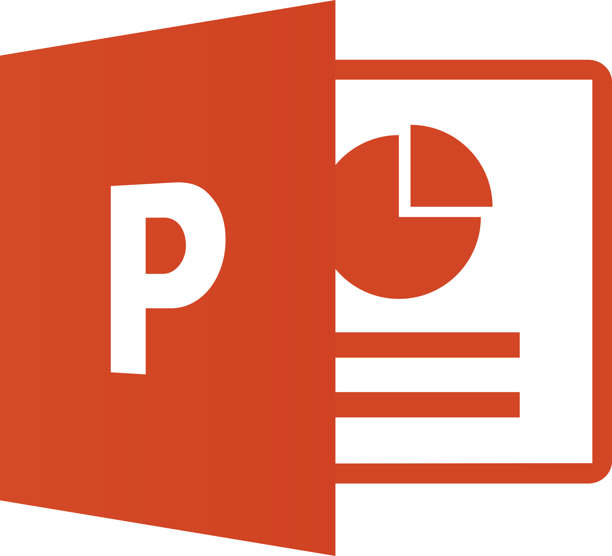

<div style="text-align: center;">
  <h1>🔥 Hello, we are <code>ByteForge</code> 🔥</h1>
  <p style="text-align: center;">
 
</p>
</div>

## 📝 Project Description
Fire Safety Information System is a student-developed web application designed to support the daily operations of fire departments.
It provides up-to-date information about fire stations, teams, vehicles, and incidents.
Users can report emergencies through an online form, view statistics, and see team activity on an interactive map.

---

## 💻 Languages, Frameworks & Tools

### 🧠 Development Technologies
  
  
  
</p>

### 🖥️ Code Editors
<p>
  
</p>

### 📄 Documentation & Presentation
<p>
  
  
</p>

---

## 📁 Documents
- 📄 [Documentation]
- 📊 [Presentation]

---
## 📥Installation
You can download our project by cloning our repo, using the "git clone" command and "Our https: " 
```
 https://github.com/codingburgas/9th-grade-html-project-byteforge.git
 ```
 ## 🥇Our Team<br>
<ul>
    <li><a href = https://github.com/DLTinchev23>Дамян Тинчев </a> - Scrum trainer<br></li>
    <li><a href = https://github.com/DSHMuhtar23>Джан Мухтар </a> - Frontend Developer<br></li>
    <li><a href = https://github.com/VTVulkov23>Велизар Вълков </a> - Backend  Developer<br></li>
</ul>